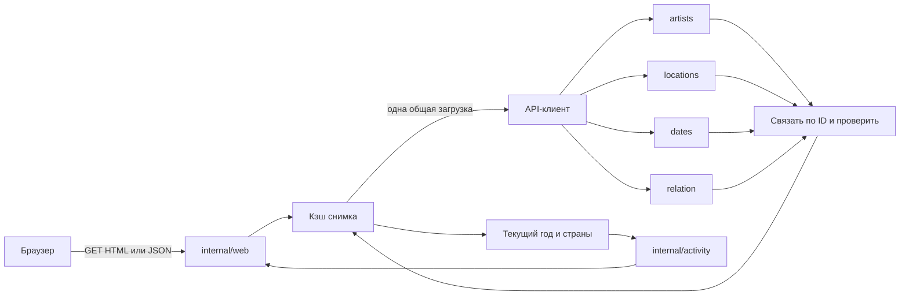

# Как устроен tour-track

## Путь запроса

Четыре API-списка похожи на четыре таблицы, связанные номером артиста. Порядок строк может различаться, поэтому соединяем по `id`, а не по позиции. Тест специально переворачивает один список и проверяет, что Queen остаётся Queen.

`artists` даёт имя, состав, фото, год основания и первый альбом. `locations` отвечает за географию. `dates` — за количество концертов. `relation` сопоставляет площадки с датами, чтобы показать расписание. Считать концерты через количество площадок неправильно: у Travis Scott десять локаций, но двенадцать дат.

## Параллелизм без лавины запросов

`Client.Load` запускает четыре goroutines и получает их результаты через буферизованный канал. Ошибка отменяет остальные запросы; функция дожидается завершения всех четырёх. Тайм-аут клиента — 8 секунд, всего обновления — 10 секунд. Redirect не выполняется. JSON-ответ ограничен 4 МиБ, лишний JSON после документа считается ошибкой.

Кэш хранит только полностью собранный снимок. Mutex защищает снимок, время и канал текущей загрузки. При 100 одновременных холодных запросах будет одна загрузка, то есть четыре обращения к API, а не четыреста.

| Состояние | Действие |
| --- | --- |
| Снимок моложе 5 минут | Вернуть немедленно |
| Снимок старше 5 минут, но не старше 24 часов | Вернуть с `stale=true`, запустить одно фоновое обновление |
| Нет снимка или он старше 24 часов | Дождаться текущей загрузки либо вернуть 503 |
| Обновление не удалось | Сохранить старый снимок; не повторять попытку 30 секунд |
| Клиент закрыл запрос | Прекратить его ожидание; общая загрузка продолжает обслуживать остальных |

Снимки после публикации не изменяются. Обработчики строят отдельные представления, не сортируют и не изменяют массивы кэша. Кэш находится в памяти одного процесса и не переживает перезапуск.

## Почему оценки не кэшируются

Исходная дискография почти не меняется, но текущий год меняется. Вызов `catalog.Enrich(artist, time.Now())` происходит на каждом запросе. При переходе с 2024 на 2025 год для артиста 2000 года основания карьерная добавка меняется с 4 на 5 даже при неизменном снимке. Это отдельный тест.

`Score` отдельно считает число, `Classify` отдельно выбирает точный порог. Отрицательные аргументы считаются нулём; экстремальные целые числа насыщаются максимально допустимым `int`, а не переполняются в отрицательные. Для обычных данных формула точно совпадает с ТЗ.

`Country` берёт часть после последнего дефиса; подчёркивания в названиях сохраняются. Алиасы `brasil/brazil`, `us/usa/united_states`, `uk/united_kingdom/great_britain` сводятся к одной стране. Raw-строки для аудита остаются нетронутыми.

## Rising Star и крайние даты

Дата API — `DD-MM-YYYY`; начальная `*` удаляется. Окно начинается с `today.AddDate(-2, 0, 0)` и заканчивается сегодня в UTC. Обе границы включены. Go нормализует 29 февраля минус два года в 1 марта; это поведение описано тестом. Будущие концерты считаются в общем числе записей по ТЗ, но не в уже состоявшейся недавней активности.

Нулевая длина карьеры не имеет средней скорости, поэтому Rising Star=false. Дробное деление используется только в сравнении скоростей, не в основной формуле. Строгое `>` сохраняет условие «более чем на 50%».

## Ошибки не становятся полупоказанной страницей

HTML создаётся через `html/template`, пользовательский ввод и данные API экранируются. JavaScript строит элементы через `textContent`; вставки произвольного `innerHTML` нет. CSP запрещает сторонние скрипты, inline-скрипты и встраивание страницы в чужой frame.

Общий middleware ограничивает 64 одновременно исполняющихся запроса и 8 МиБ ответа. Ответ буферизуется до отправки: при panic даже после частичной записи клиент получает целый 500, а не оборванный 200. Подробности остаются в серверном журнале. Дополнительные лимиты: адрес запроса 4096 байт, заголовки 16 КиБ, чтение заголовков 5 секунд, чтение запроса 10 секунд, запись 20 секунд, idle 60 секунд.

Перегрузка отдаёт 503 с повторной попыткой. SIGINT/SIGTERM прекращает работу через `Shutdown` с пределом 10 секунд. Операционная система, исчерпание всей памяти, аппаратные сбои и внешние лимиты хостинга не могут быть полностью устранены кодом приложения.

## Событие в браузере

Ввод поиска запускает задержку 280 мс и `fetch('/api/artists?...')`. Сервер возвращает отфильтрованные данные и оценки. Браузер обновляет карточки, URL, сообщение для screen reader и время снимка. Старый запрос отменяется; порядковый номер не позволяет запоздавшему ответу затереть новый результат. При ошибке последние карточки сохраняются, рядом появляется сообщение. Back/Forward повторяет состояние из URL.

Без JavaScript та же форма отправляет обычный GET, и сервер рисует весь HTML. Бонус асинхронности есть и в браузере, и на Go-сервере, где используются goroutines и channels.

## Вопросы для самостоятельного разбора

1. Почему 10 площадок не обязательно означают 10 концертов?
2. Что получает второй клиент, если первый отменил ожидание API?
3. Почему данные из `testdata` не подставляются посетителю при сбое?
4. Почему при 30 карьерных годах добавляется 6, а при 70 — только 10?
5. При каких обстоятельствах HTTP 404 — корректное поведение?
6. Чем дата загрузки архива отличается от даты концерта?

Эти объяснения помогают изучать проект; реальное понимание проверяется разбором и изменением кода, а не автоматическим тестом.
